# Technical Document - Multiclass Cancer Classification using Gene Expression Data

## Executive Summary

Advances in high-throughput sequencing have enabled the profiling of microRNAs (miRNAs), resulting in an abundance of sequencing data that if leveraged properly has the potential for cancer classification. Previously, the diagnosis of complex diseases such as cancer has involved relying on non-molecular criteria such as the stage of cancer, tumor type (primary, metastasized, malignant, benign), and other pathological features. However, with advancements in sequencing technology and lowered sequencing costs, there is great interest in the scientific community to use genetic expression profiles to develop a more robust method of diagnosing a cancer patient with a higher degree of accuracy than standard pathology practices alone. 

By collating the expression data of a panel of miRNAs from thousands of samples derived from various cancer patients, we can apply deep learning techniques to discern patterns in expression data that otherwise could not be done feasibly from one sequencing experiment alone. 

## Part 1: Problem Statement

Can miRNA expression data from various cancer patients be used to build and train a multi-class tumor diagnosis classifier?

## Part 2: Raw Data Acquisition

The [NCI GDC data portal](https://portal.gdc.cancer.gov/repository) provides an interface to obtain biological data. We will be using microRNA (miRNA) expression quantification data derived from sequencing experiments. 

For the purposes of building a tumor diagnosis classifier, we will obtain data about several different cancers from the The Cancer Genome Atlas (TCGA) consortium via the NCI GDC data portal. 

- TCGA-BRCA (Breast Cancer)
- TCGA-LUAD (Lung Adenocarcinoma)
- TCGA-KIRC (Kidney Renal Clear Cell Carcinoma)
- TCGA-UCEC (Uterine Corpus Endometrial Carcinoma)
- TCGA-HNSC (Head and Neck Squamous Cell Carcinoma)
- TCGA-LGG  (Low Grade Glioma)

Using the interface, in the Cases tab, select the TCGA program and the above projects in the Project section. In the Files tab, select Transcriptome profiling in the Data Category section, and miRNA expression quantification in the Data type section. This should return a list of 4,068 txt files. Add all the files to the cart. Go to cart and select the manifest option upon pressing the download button. The manifest is a txt file containing the file id numbers of the selected files and will be used in conjuction with the GDC's Data Transfer Tool to download the files selected. 

Download the [Data Transfer Tool](https://gdc.cancer.gov/access-data/gdc-data-transfer-tool) by downloading the appropriate binary distribution for your machine, unzipping it, and copying it over to a location that's in the user's PATH variable in the terminal. Follow the DTT's command line [documentation](https://docs.gdc.cancer.gov/Data_Transfer_Tool/Users_Guide/Data_Download_and_Upload/) to download data using the manifest file. 

Create a directory to house the data dump and run the following command to download the data.

! gdc-client download -m gdc_manifest_20190204_230647.txt

## Part 3: Data Mining

In order to construct a working dataset from the datafiles obtained from the GDC repository, we need to extract each the miRNA expression data from each file and assemble it into a working dataset with its associated tumor classification. In our case, we will be using the Project ID as assigned by TCGA to denote the cancer classification as the Project ID represents data that's derived from the respective cancer type. 

For our purposes, let (xi, yi) be a collection of n observations, where x is a vector consisting of the expression levels of $m$ genes for the $i$-th observation, and $y_{i}$ is the class label or tumor type of the $i$-th observation, $i = 1, ..., n$.

Put simply, the rows should be the samples with the columns as the miRNA. The values of the matrix represent the expression level of a given miRNA in a given sample. Each sample would have its associated tumor diagnosis.

Below is an example of how the dataset should appear:

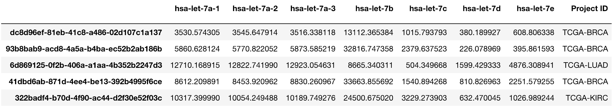

In the modeling phase, the Project ID which serves as the tumor class will be the target value to predict based on the gene expression data.

## Part 4: Classification modeling

To build a classification model that can predict the cancer type, the working dataset described above is split into a train and test dataset where the train dataset is used to train the model. Once the model has been trained, it will be given the test dataset (data it has not yet seen) and scored on how accurately it predicts the tumor class. Accuracy scores will be the primary metric in determining the performance of the model. 

For our purposes, we will test various supervised learning models: Logistic Regression, Random Forest, and ExtraTrees. As well, we will train a neural network to predict tumor class. PCA analysis will be used to reduce the dimensionality of the dataset. 

## Part 5: Model Evaluation and Insights

Several different classification models will be trained including a Multinomial Logistic Regression, Random Forest, ExtraTrees, and Neural Net. Principal Components Analysis will be done to assess the overall variance contributed by each miRNA variable in this high dimensional dataset.

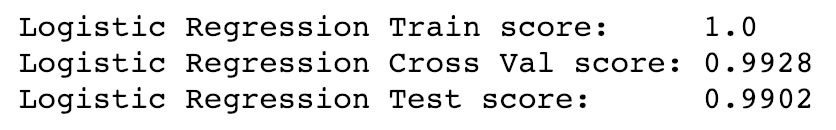

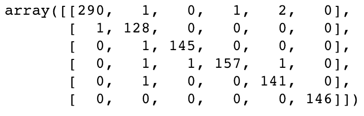

- The logistic regression model has a training accuracy score of 100% which is unusually accurate. 
- The cross validation score of 99.28% suggests that the estimated accuracy is on par with the training set score. 
- The model performs with an accuracy of 99.02% on the test set. 
- The confusion matrix depicts that the model has accurately classified the samples to their appropriate tumor diagnoses with very few samples being misclassified.

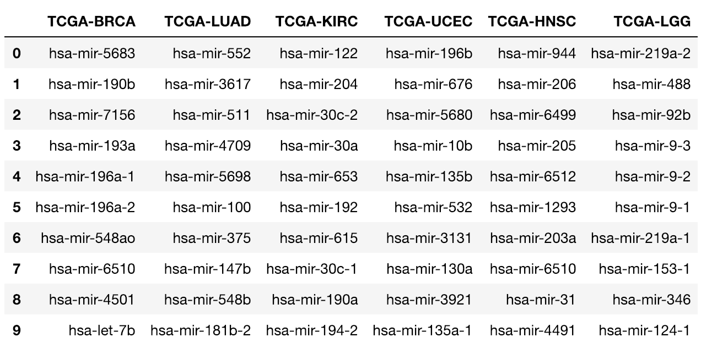

- This table shows the top 10 miRNAs that influence the predictive capabilities of the classifier.
- It is evident that these miRNAs are unique to the cancer type with no overlapping miRNAs.
- Few notable miRNAs among that many displayed:
    - [hsa-mir-190b has been shown to characterize the luminal-A/B breast cancer subtypes with a high level of expression.][1]
    - [hsa-mir-552 has been shown to be expressed at high levels in Primary Lung Adenocarcinoma.][2]
    - [hsa-mir-122 has been shown to promotes proliferation and invasion of clear cell renal cell carcinoma.][3]

[1]: https://www.ncbi.nlm.nih.gov/pmc/articles/PMC3043070/
[2]: http://ar.iiarjournals.org/content/34/5/2297.full.pdf
[3]: https://www.ncbi.nlm.nih.gov/pubmed/30483771

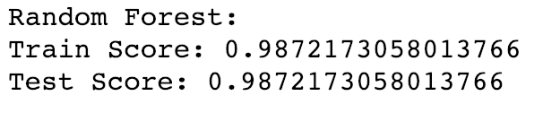

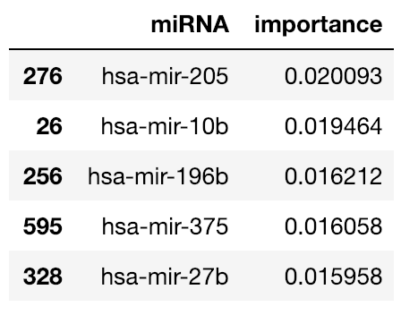

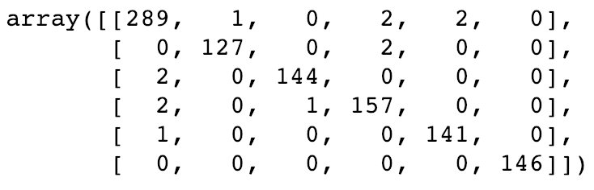

- It appears that 611 miRNAs do not have an importance value associated with it, leaving 1270 miRNAs that play a role in the classification of cancer types. The miRNA with the highest feature importance is hsa-mir-205. 
- We are limited in obtaining a list of miRNAs that serve as a signature of a specific cancer type. 
- The confusion matrix again shows that a Random forest model results in a very high accuracy rate of 98.7% on both training and test datasets.

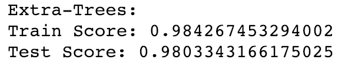

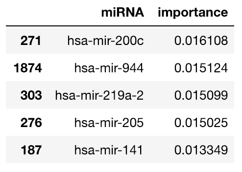

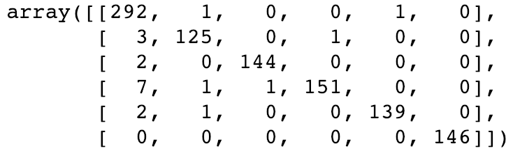

- Compared to the Random Forest Model, the ExtraTrees model doesn't assign an importance value to 311 miRNAs, leaving 1570 miRNAs that play a role in the classification of cancer types. The miRNA with the highest feature importance is hsa-mir-200c. 
- The confusion matrix shows that the ExtraTrees model has a very high accuracy rate of 98% on both training and test datasets. However, this model does have more misclassifications than the Logistic Regression or Random Forest. For example, 7 samples that otherwise have the cancer class of UCEC seem to be classified by the model as BRCA. It is likely that the expression profiles of these 7 samples match those of BRCA samples, thus further investigation into those samples would be required. 

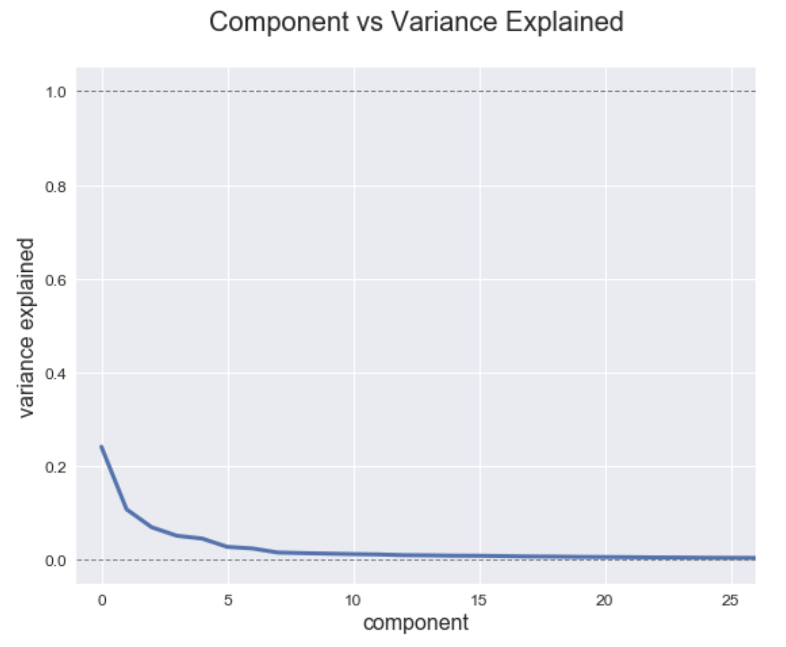

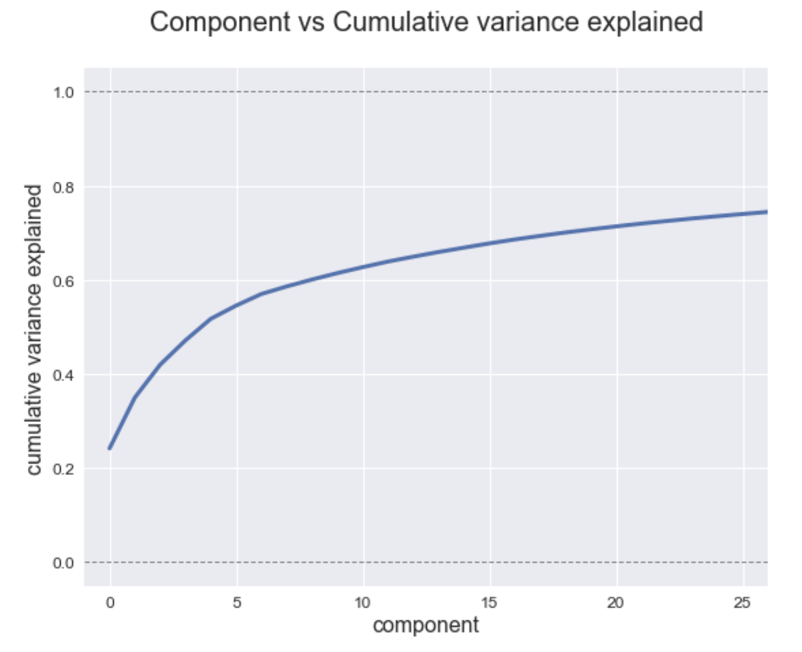

- The PCA analyses of the original training and scaled training set differ greatly with respect to how much variance is explained in the constituent components. 
- When looking at the variance explained by 100 Principal components, for the scaled data, only 42% of the variance is explained as opposed to 87% for the unscaled data. This may be due to the fact that scaling the training data is removing a substantial amount of overall variance such that each principal component explains a lesser amount of variance overall.

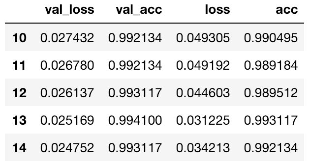

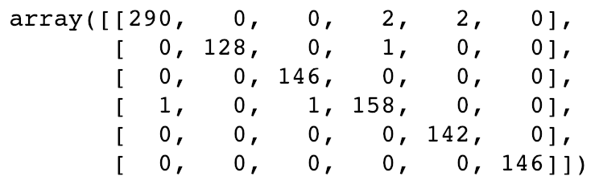

- The Neural Network with the PCA transformed data seemed to have a decreasing loss function that is characteristic of a Neural Net as opposed to the normal X train scaled data. 
- In both cases, the accuracy achieved by the model on the test data was 99.9% and 99.2% for PCA transformed data and original X train scaled data, respectively.
- Due to the inherent nature of how a Neural Net works, it is not possible to get information on which features seem to have an influence on the classification. 
- However, the confusion matrices show once that the accuracy was superb with very little misclassifications.

## Part 6: Future Directions

This work provides a rather preliminary approach to the classification of cancer diagnoses using miRNA expression data. Its known that miRNA play complex regulatory roles in cell biology and often times there is overlap in what mRNA miRNAs target. Thus, further investigation is required specifically trying to look at corresponding target expression data.

A possible method of modeling real world biological processes would be to use Bayesian approaches to infer the expression level of a whole host of miRNAs or more generally, genes, based on the expression level of landmark genes. This would allow the rapid assessment of the key landmark genes from which the expression level of all other genes can be inferred. 

